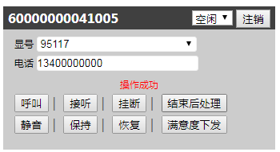

#   ccbar.js


##  初始化ccbar
```
    // 初始化ccbar
    var _ccbar = new CCBAR.CORE.CCBAR({
        enterprise: 企业简称,
        account: 坐席账号,
        password: 坐席登录密码,
        skillGroupId: 签入的技能组ID
    });
```

##  方法
|    方法名     |                    参数                     |      说明       |
| :-----------: | :-----------------------------------------: | :-------------: |
|    signIn     |                     无                      |      签入       |
| getNumberList |                     无                      |  获取显号列表   |
| changeStatus  | status：number（1：空闲；2：小休；3：忙碌） |  坐席状态切换   |
|  normalCall   |       phone:呼叫号码；displayNum:显号       |     打电话      |
|    endCall    |                  sessionId                  |    结束电话     |
|     mute      |                  sessionId                  |      静音       |
|    holdOn     |                  sessionId                  |    保持通话     |
|  resumeCall   |                  sessionId                  |    恢复通话     |
|   satisfiy    |                  sessionId                  |   下发满意度    |
|    signOut    |                     无                      |      签出       |
|    getSip     |                     无                      | 查询sip相关参数 |

##  getWebSocketSubject回调
软电话机状态消息推送回调。

| 字段  |                                              值                                               |     说明      |
| :---: | :-------------------------------------------------------------------------------------------: | :-----------: |
| type  | 1-建立连接<br/>2-坐席状态<br/> 3-自动呼叫消息<br/>4-通知消息<br/> 5-出登录消息<br/>6-通话弹窗 |     类型      |
|  msg  |                                           WsMessage                                           | WsMessage消息 |

### WsMessage
|    字段    |  类型  |               说明               |
| :--------: | :----: | :------------------------------: |
|   seatId   | number |              坐席id              |
|   status   | string |           坐席状态名称           |
| statusCode | number | 坐席状态值（详情参考statusCode） |
| sessionId  | string |           通话唯一标识           |
|    ttl     | number |      后处理倒计时（单位秒）      |
|   phone    | string |             弹屏电话             |
| timestamp  | number |              时间戳              |

### statusCode
|  值   |            说明             |
| :---: | :-------------------------: |
|   0   |        未签入 UNSIGN        |
|   1   |          空闲 FREE          |
|   2   |         小休 BREAK          |
|   3   |          忙碌 BUSY          |
|   4   |   呼叫坐席中 SEAT_CALLING   |
|   5   |   坐席振铃中 SEAT_RINGING   |
|   6   | 呼叫客户中 CALLING_CUSTOMER |
|   7   | 客户振铃中 CUSTOMER_RINGING |
|   8   |   外呼通话中 OUT_CALLING    |
|   9   |    来电振铃中 IN_RINGING    |
|  10   |    来电通话中 IN_CALLING    |
|  11   |      后处理 AFTER_DEAL      |

##  getWebRTCSubject回调
软电话机sip消息推送回调。


| code  |            msg            |
| :---: | :-----------------------: |
| 6001  |       SIP注册成功！       |
| 6002  |        SIP未注册！        |
| 6003  |       SIP注册失败！       |
| 6004  |          message          |
| 6005  | outOfDialogReferRequested |
| 6006  |     transportCreated      |
| 6007  |      您有新的来电！       |
| 6008  |      未检测到来电！       |
| 6009  |    未检测到音频设备！     |
| 60010 | 浏览器无法获取音频设备！  |


##  getInterfaceSubject回调
软电话机接口消息推送回调。

| code  |        msg         |
| :---: | :----------------: |
| 5001  |     签入失败！     |
| 5002  | 获取显号列表失败！ |
| 5003  | 坐席状态切换失败！ |
| 5004  |     外呼失败！     |
| 5005  |   结束通话失败！   |
| 5006  |     静音失败！     |
| 5007  |     保持失败！     |
| 5008  |     恢复失败！     |
| 5009  |  下发满意度失败！  |
| 50010 |     签出失败！     |
| 50011 |   获取sip失败！    |
| 2001  |     签入成功！     |
| 2002  | 获取显号列表成功！ |
| 2003  | 坐席状态切换成功！ |
| 2004  |     外呼成功！     |
| 2005  |   结束通话成功！   |
| 2006  |     静音成功！     |
| 2007  |     保持成功！     |
| 2008  |     恢复成功！     |
| 2009  |  下发满意度成功！  |
| 20010 |     签出成功！     |
| 20011 |   获取sip成功！    |
